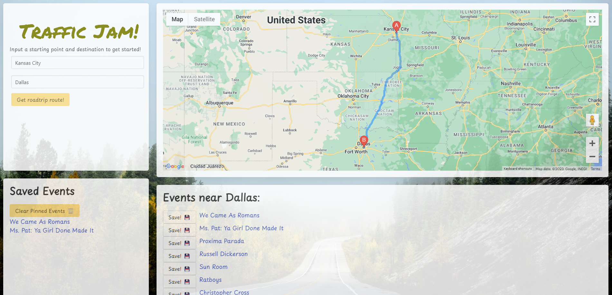

# Traffic Jam
A webpage to plan a roadtrip to see concerts!

## Description
Traffic Jam is a responsive webpage application that combines the power of Google Routes API and TicketMaster API to create a roadtrip route and display events available near the destination. When a user inputs a start and end location, they are returned a map that displays their driving route. The app will simultaneously display information about concerts, sports games, and other events to turn a boring roadtrip into a real Jam! Users can save their favorite events for easy tracking. Traffic Jam uses Bulma CSS framework for a clean and intuitive user interface and DayJS to set time parameters. 

## User Story
As a travel enthusiast,
I want to plot a route to my destination and view fun events,
So that I can visit events on my travels.

## Authors
Dani Sweetwood (https://github.com/DaniSweets)
Braidey Hooper (https://github.com/BraideyH)
Adrian Garcia (https://github.com/adriang1004)
Heather Crawford (https://github.com/eagersidekick)

## License
This project is licensed under the MIT license. See the license for more information.

## Screenshots

## Link to Webpage
https://eagersidekick.github.io/Traffic_Jam/
